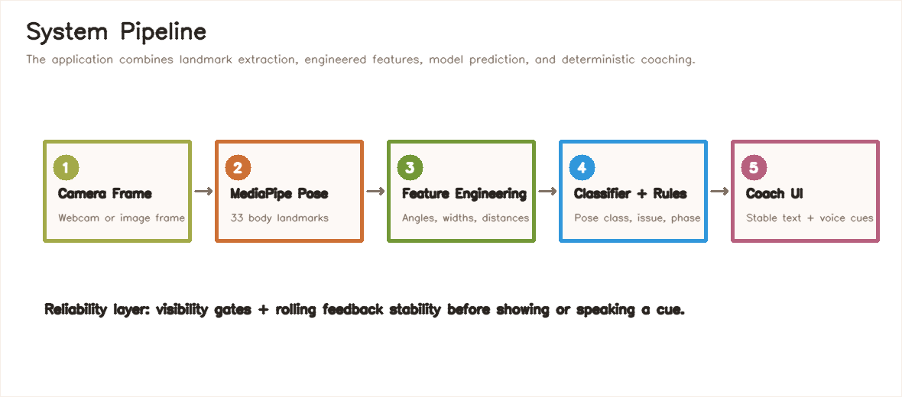
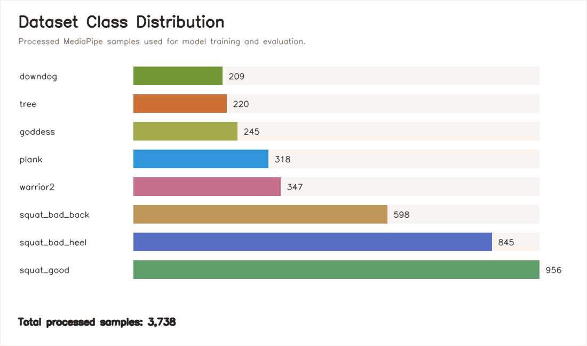
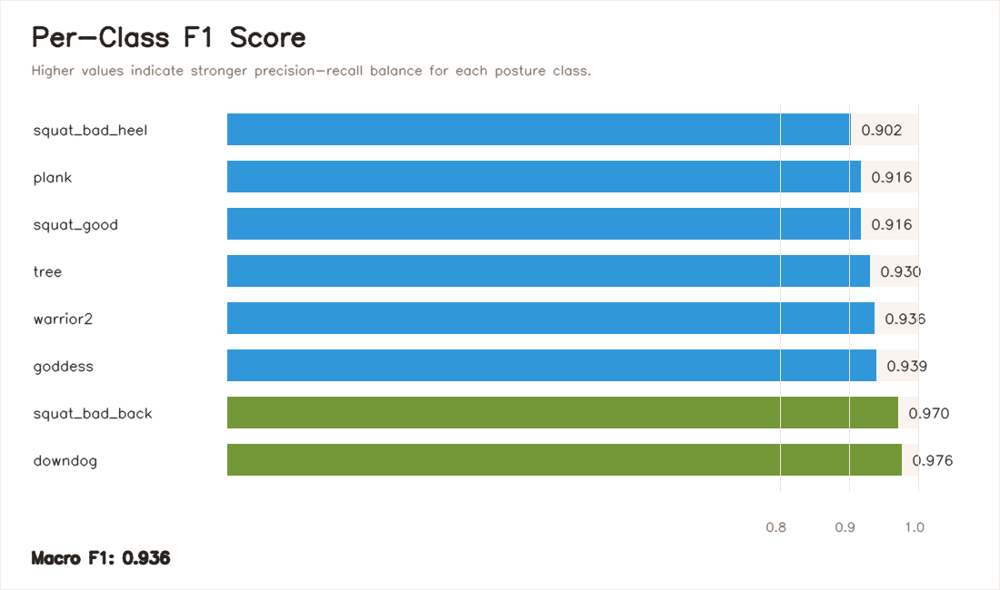
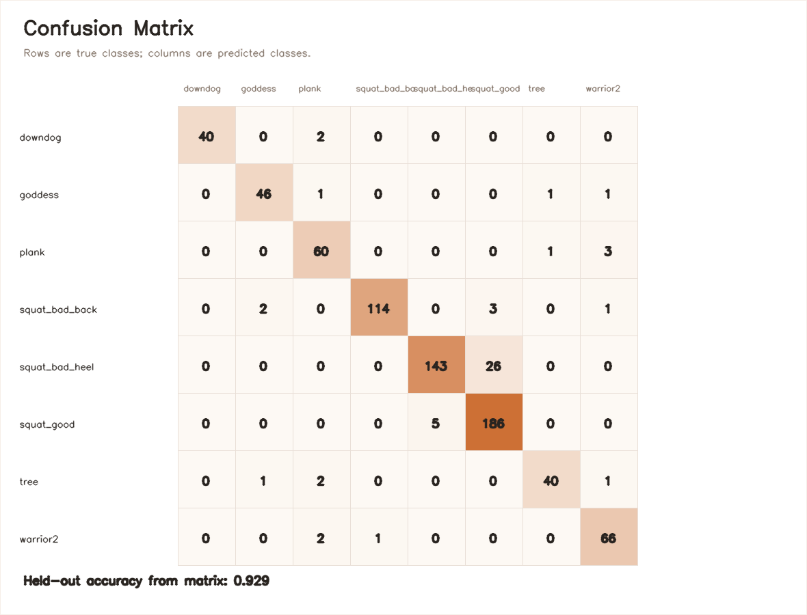

# Your Gym Buddy: Real-Time Posture Coaching System

## Project Defense Report

**Project title:** Your Gym Buddy  
**Domain:** Computer vision, human pose estimation, fitness coaching, real-time web application  
**Core technologies:** MediaPipe Pose, OpenCV, scikit-learn, React, Express, Python  

---

## 1. Executive Summary

Your Gym Buddy is a real-time posture coaching system designed to help users receive immediate feedback while performing exercises and yoga poses. The system uses MediaPipe Pose to extract human body landmarks, converts those landmarks into engineered biomechanical features, classifies the pose using a trained machine learning model, and generates deterministic coaching feedback through posture-specific rules.

The project includes both a Python-based posture analyzer and a web application. The web version captures webcam frames, sends them to a Node/Express backend, runs the Python pose feedback engine, and presents coaching feedback through text, optional voice cues, workout timers, pose hold tracking, and squat repetition counting.

The trained classifier was evaluated on a held-out test set of **748 samples** and achieved:

- **Accuracy:** 0.929
- **Macro Precision:** 0.941
- **Macro Recall:** 0.933
- **Macro F1 Score:** 0.936
- **Weighted F1 Score:** 0.929

These results show that the system is strong enough for a prototype posture assistant, especially because final coaching feedback is not based only on model prediction. It is also protected by landmark visibility checks, deterministic form rules, and a rolling feedback stability gate.

---

## 2. Problem Statement

Many people perform workouts or yoga poses without a trainer watching their form. This can lead to:

- Poor posture habits
- Reduced training effectiveness
- Higher risk of strain or injury
- Lack of confidence during home workouts

The project addresses this problem by building a lightweight AI form coach that can run from a webcam and give immediate feedback such as:

- Whether the selected pose is visible
- Whether the posture looks stable
- Whether the user needs to adjust depth, torso angle, hip position, or knee bend
- How long the user has held a pose
- How many squat repetitions have been completed

The goal is not to replace a human trainer. The goal is to provide accessible, real-time, low-cost posture guidance.

---

## 3. Literature Review

Human pose estimation has become one of the most important areas of computer vision because it converts images or videos of people into structured body-joint representations. Earlier deep-learning approaches such as DeepPose formulated pose estimation as a direct regression problem from an image to body joint coordinates, showing that neural networks could reason about the human body holistically rather than only through local part detectors [1]. Later systems such as OpenPose improved real-time 2D pose estimation by introducing Part Affinity Fields, which associate detected body parts with individual people and support real-time multi-person tracking [2]. These works established the foundation for applications such as activity recognition, motion analysis, augmented reality, rehabilitation, and human-computer interaction [3], [4].

For a real-time fitness assistant, computational efficiency is as important as accuracy. BlazePose was designed specifically for on-device real-time body pose tracking and outputs 33 body keypoints, making it suitable for fitness and movement-analysis applications where low latency is required [5]. MediaPipe provides a practical graph-based framework for deploying perception pipelines, including pose tracking, in real-time applications [6]. This project builds on that direction by using MediaPipe Pose as the landmark detector rather than training a pose-estimation network from scratch. This choice is practical for a student project because it allows the main contribution to focus on posture interpretation, feedback reliability, and user interaction.

Several previous systems have explored exercise correction using pose estimation. Chen and Yang’s Pose Trainer used pose estimation, vector geometry, and machine learning to detect exercise form problems and provide corrective recommendations [7]. Similar AI fitness trainer systems use body landmarks to compute joint angles and compare them against expected movement patterns [8], [9]. These works support the central design decision of this project: posture feedback should not be generated from raw pixels alone. Instead, detected landmarks should be converted into meaningful geometric quantities such as knee angle, hip angle, torso lean, and joint alignment.

The feedback rules in this project are also motivated by exercise biomechanics. Squatting is widely used in strength training and rehabilitation, and its quality depends on coordinated motion at the ankle, knee, hip, trunk, and spine [10]. Reviews of squat biomechanics emphasize that squat depth, trunk position, tibial position, stance, and joint loading all influence exercise performance and safety [10], [11]. Because this project uses a standard webcam and 2D landmarks, it does not attempt medical-grade biomechanical analysis. However, it can still provide useful coaching cues for visible form patterns such as shallow squat depth, excessive torso folding, unstable plank hip position, and insufficient knee bend.

Machine learning is used in this project as a pose classifier over engineered landmark features. Random Forests are appropriate for this type of tabular feature problem because they combine multiple decision trees, handle nonlinear feature interactions, and are relatively robust to noise [12]. The implementation uses scikit-learn, a widely used Python machine-learning library that provides consistent tools for supervised learning, model evaluation, preprocessing, and metrics [13]. This makes the training and evaluation process reproducible and easier to explain during defense.

The project also follows a deterministic-first feedback philosophy. In real-time coaching, the system should avoid overreacting to noisy single-frame predictions. Prior work on motor learning emphasizes the importance of feedback in skill acquisition, but feedback must be understandable and appropriately timed [14], [15]. For that reason, this project adds landmark visibility gates, structured issue labels, rolling stability checks, and voice cooldowns before speaking or displaying corrective feedback. Voice output is implemented using the browser Web Speech API, which supports speech synthesis directly in web applications without requiring a separate text-to-speech service [16], [17].

Overall, the literature supports the project’s architecture: use a proven real-time pose detector, transform landmarks into interpretable biomechanical features, classify posture with a suitable tabular model, and generate controlled feedback through explicit rules. The result is more explainable than an end-to-end black-box system and more practical for real-time use than relying on a large vision-language model for every frame.

---

## 4. System Overview

The system follows a deterministic-first design. Machine learning is used to recognize posture patterns, but final safety and coaching cues are produced by explicit rules. This makes the feedback more explainable and easier to defend than a black-box text response.



### Main Components

| Component | Purpose |
|---|---|
| React frontend | Captures webcam frames, displays feedback, tracks session stats |
| Express backend | Receives frames and calls the Python analyzer |
| MediaPipe Pose | Extracts 33 human body landmarks |
| Feature engineering module | Converts landmarks into angles, distances, ratios, and posture metrics |
| Random Forest classifier | Predicts the posture class from engineered features |
| Rule-based feedback engine | Generates form-specific coaching cues |
| Stability gate | Prevents random or flickering feedback from single-frame noise |
| Voice cue system | Speaks accepted corrective cues when enabled |

---

## 5. Dataset

The processed dataset contains **3,738 samples** across eight posture classes:

| Class | Samples |
|---|---:|
| downdog | 209 |
| goddess | 245 |
| plank | 318 |
| squat_bad_back | 598 |
| squat_bad_heel | 845 |
| squat_good | 956 |
| tree | 220 |
| warrior2 | 347 |



The dataset includes both correct and incorrect squat examples. This is important because the system is not only trying to recognize poses; it is trying to distinguish good form from common mistakes such as:

- Rounded or folded torso during squat
- Heel-related squat issues
- Shallow squat depth
- Incorrect hip alignment in static poses

---

## 6. Feature Engineering

Raw landmark coordinates alone are sensitive to camera position, body size, and image placement. To improve robustness, the project computes engineered features from MediaPipe landmarks.

Examples of engineered features include:

- Left and right knee angles
- Left and right hip angles
- Left and right ankle angles
- Torso angle relative to horizontal
- Shoulder, hip, knee, and ankle widths
- Femur and tibia length estimates
- Hip-to-ankle center distance
- Knee-to-ankle ratios
- Knee-forward displacement

The feature pipeline also normalizes landmark positions by body scale and orientation. This helps reduce dependency on the user’s distance from the camera or exact position in the frame.

This design makes the model easier to justify during defense because the inputs correspond to meaningful body mechanics rather than opaque pixel values.

---

## 7. Model Training

The classifier is trained using a Random Forest model. Random Forest was selected because:

- It works well on tabular engineered features
- It is less sensitive to feature scaling than many other models
- It supports nonlinear decision boundaries
- It is interpretable enough for a prototype defense
- It trains quickly on the available dataset

The training process includes class balancing to reduce bias toward overrepresented classes. The trained model is saved as:

- `models/pose_classifier.pkl`
- `models/label_encoder.pkl`

The model artifact also stores the feature schema so the runtime analyzer can detect mismatches between training features and inference features.

---

## 8. Evaluation Results

The model was evaluated on a stratified held-out test split containing **748 samples**.



### Per-Class Performance

| Class | Precision | Recall | F1 Score | Support |
|---|---:|---:|---:|---:|
| downdog | 1.000 | 0.952 | 0.976 | 42 |
| goddess | 0.939 | 0.939 | 0.939 | 49 |
| plank | 0.896 | 0.938 | 0.916 | 64 |
| squat_bad_back | 0.991 | 0.950 | 0.970 | 120 |
| squat_bad_heel | 0.966 | 0.846 | 0.902 | 169 |
| squat_good | 0.865 | 0.974 | 0.916 | 191 |
| tree | 0.952 | 0.909 | 0.930 | 44 |
| warrior2 | 0.917 | 0.957 | 0.936 | 69 |

### Summary Metrics

| Metric | Score |
|---|---:|
| Accuracy | 0.929 |
| Macro Precision | 0.941 |
| Macro Recall | 0.933 |
| Macro F1 | 0.936 |
| Weighted F1 | 0.929 |



The strongest classes are `downdog` and `squat_bad_back`, while `squat_bad_heel` has the lowest recall. This suggests that heel-related squat errors may be harder to identify from 2D landmarks alone, especially when the foot or heel is partially hidden or the camera angle is not ideal.

---

## 9. Real-Time Feedback Mechanism

The web app does not blindly display every frame’s result. The feedback mechanism has been improved to make cues more reliable.

### Feedback Reliability Layers

1. **Visibility gating**  
   The system first checks whether key joints are visible enough. If important joints are missing, feedback is blocked and the user is asked to adjust the camera.

2. **Structured issue output**  
   The Python analyzer returns structured fields:

   ```json
   {
     "status": "needs_adjustment",
     "issue": "squat_torso_fold",
     "phase": "bottom",
     "severity": 0.72,
     "feedback": "Keep chest up and brace your core to avoid folding forward."
   }
   ```

3. **Rolling stability gate**  
   The frontend stores the most recent feedback keys and only accepts a corrective cue after the same issue appears repeatedly. This reduces random feedback caused by one noisy frame.

4. **Voice cue cooldown**  
   Voice feedback is optional and only speaks stable corrective cues. It does not speak every frame, and it does not speak normal “good form” messages.

This design makes the system feel calmer and more trainer-like.

---

## 10. User Features

The web app includes several user-facing features beyond basic feedback:

| Feature | Description |
|---|---|
| Target pose selection | User chooses squat, plank, downdog, tree, warrior2, or goddess |
| Real-time coach mode | Continuously analyzes webcam frames |
| One-frame analysis | Allows manual testing of a single captured frame |
| Voice cues | Optional spoken corrective instructions |
| Workout timer | Tracks active real-time coaching duration |
| Pose hold timer | Tracks how long the selected pose is successfully detected |
| Squat rep counter | Counts squat repetitions from bottom-to-standing phase transitions |
| Reset stats | Resets timers and repetition count |

These features make the application more useful as a training assistant rather than only a classifier demo.

---

## 11. Strengths of the Project

- Uses real computer vision landmarks instead of manual input.
- Uses engineered biomechanical features rather than raw pixels.
- Includes both model-based classification and rule-based coaching.
- Provides real-time webcam interaction through a web interface.
- Includes confidence gating for safer feedback.
- Includes stability filtering to reduce flickering or unreliable cues.
- Supports text and voice feedback.
- Tracks workout time, pose time, and squat repetitions.
- Produces evaluation reports and visual metrics.

---

## 12. Limitations

The system is a strong prototype, but it has known limitations:

- It uses 2D landmarks, so depth-related issues can be difficult to detect.
- Camera angle strongly affects squat and foot-related feedback.
- Heel errors are harder to detect reliably when feet are not clearly visible.
- The web version currently starts a Python process for analysis, which adds latency.
- The squat rep counter depends on clear phase transitions from the analyzer.
- The system should not be used as medical or injury-prevention advice.

These limitations are expected for a webcam-based prototype and create clear directions for future improvement.

---

## 13. Future Improvements

The most valuable next steps are:

1. **Persistent analyzer process**  
   Keep MediaPipe loaded instead of starting Python for every frame. This would reduce latency significantly.

2. **Browser-side pose detection**  
   Run MediaPipe directly in the browser and send only features or metrics to the backend.

3. **Vision model second opinion**  
   Add an optional “Detailed Form Review” button that sends a captured frame to a vision model for a richer explanation. This should not be used in the real-time loop because it would be slower and less deterministic.

4. **User calibration**  
   Record a short baseline for each user so thresholds can adapt to body proportions and mobility.

5. **Better rep counting**  
   Move squat phase tracking into a persistent session state so reps are counted from continuous motion rather than separate image requests.

6. **Expanded dataset**  
   Add more camera angles, lighting conditions, body types, and exercise mistakes.

---

## 14. Defense Talking Points

If asked why this approach is suitable:

- The system uses MediaPipe because it provides reliable real-time human landmarks without needing to train a pose detector from scratch.
- The model uses engineered features because posture is better represented by angles and distances than by raw image pixels.
- Random Forest is appropriate because the features are tabular, nonlinear, and interpretable enough for a prototype.
- Feedback is deterministic-first because safety cues should be controlled and explainable.
- Voice feedback is optional because repeated audio can distract users.
- A vision-language model could be added later, but it is better as a slow detailed review tool than as the core real-time feedback engine.

If asked about reliability:

- The system checks landmark visibility before giving feedback.
- The frontend waits for repeated evidence before accepting corrective cues.
- The report includes held-out test results, not only training accuracy.
- The limitations are clearly identified, especially camera angle and 2D landmark constraints.

---

## 15. References

[1] A. Toshev and C. Szegedy, “DeepPose: Human Pose Estimation via Deep Neural Networks,” *Proceedings of the IEEE Conference on Computer Vision and Pattern Recognition (CVPR)*, pp. 1653-1660, 2014. DOI: 10.1109/CVPR.2014.214. Available: https://www.cv-foundation.org/openaccess/content_cvpr_2014/papers/Toshev_DeepPose_Human_Pose_2014_CVPR_paper.pdf

[2] Z. Cao, T. Simon, S.-E. Wei, and Y. Sheikh, “Realtime Multi-Person 2D Pose Estimation Using Part Affinity Fields,” *Proceedings of the IEEE Conference on Computer Vision and Pattern Recognition (CVPR)*, 2017. Available: https://openaccess.thecvf.com/content_cvpr_2017/html/Cao_Realtime_Multi-Person_2D_CVPR_2017_paper.html

[3] Q. Dang, J. Yin, B. Wang, and W. Zheng, “Deep Learning Based 2D Human Pose Estimation: A Survey,” *Tsinghua Science and Technology*, vol. 24, no. 6, pp. 663-676, 2019. DOI: 10.26599/TST.2018.9010100. Available: https://www.sciopen.com/article/10.26599/TST.2018.9010100

[4] N. Sarafianos, B. Boteanu, B. Ionescu, and I. A. Kakadiaris, “3D Human Pose Estimation: A Review of the Literature and Analysis of Covariates,” *Computer Vision and Image Understanding*, vol. 152, pp. 1-20, 2016. DOI: 10.1016/j.cviu.2016.09.002.

[5] V. Bazarevsky, I. Grishchenko, K. Raveendran, T. Zhu, F. Zhang, and M. Grundmann, “BlazePose: On-device Real-time Body Pose Tracking,” arXiv:2006.10204, 2020. Available: https://arxiv.org/abs/2006.10204

[6] C. Lugaresi et al., “MediaPipe: A Framework for Building Perception Pipelines,” arXiv:1906.08172, 2019. Available: https://arxiv.org/abs/1906.08172

[7] S. Chen and R. R. Yang, “Pose Trainer: Correcting Exercise Posture using Pose Estimation,” arXiv:2006.11718, 2020. Available: https://arxiv.org/abs/2006.11718

[8] A. G, M. Anas, N. Kumar B, R. G, and V. Jituri, “AI Fitness Trainer Using Human Pose Estimation,” *International Journal of Engineering Research & Technology*, vol. 11, issue 08, 2023. DOI: 10.17577/IJERTCONV11IS08017. Available: https://www.ijert.org/ai-fitness-trainer-using-human-pose-estimation

[9] M. C. Patel and N. B. Kalani, “Personal Exercise Assistant: Correcting Exercise Posture using Modified Open Pose,” *Mathematical Statistician and Engineering Applications*, vol. 71, no. 4, pp. 10347-10358, 2022. DOI: 10.17762/msea.v71i4.1871. Available: https://www.philstat.org/index.php/MSEA/article/view/1871

[10] B. J. Schoenfeld, “Squatting Kinematics and Kinetics and Their Application to Exercise Performance,” *Journal of Strength and Conditioning Research*, vol. 24, no. 12, pp. 3497-3506, 2010. DOI: 10.1519/JSC.0b013e3181bac2d7. Available: https://pubmed.ncbi.nlm.nih.gov/20182386/

[11] R. K. Straub and C. M. Powers, “A Biomechanical Review of the Squat Exercise: Implications for Clinical Practice,” *International Journal of Sports Physical Therapy*, vol. 19, no. 4, pp. 490-501, 2024. DOI: 10.26603/001c.94600. Available: https://pubmed.ncbi.nlm.nih.gov/38576836/

[12] L. Breiman, “Random Forests,” *Machine Learning*, vol. 45, pp. 5-32, 2001. DOI: 10.1023/A:1010933404324. Available: https://link.springer.com/article/10.1023/A:1010933404324

[13] F. Pedregosa et al., “Scikit-learn: Machine Learning in Python,” *Journal of Machine Learning Research*, vol. 12, pp. 2825-2830, 2011. Available: https://www.jmlr.org/papers/v12/pedregosa11a.html

[14] Y. Zhou, W. D. Shao, and L. Wang, “Effects of Feedback on Students’ Motor Skill Learning in Physical Education: A Systematic Review,” *International Journal of Environmental Research and Public Health*, vol. 18, no. 12, 6281, 2021. DOI: 10.3390/ijerph18126281. Available: https://www.mdpi.com/1660-4601/18/12/6281

[15] M. Geisen and S. Klatt, “Real-time Feedback Using Extended Reality: A Current Overview and Further Integration into Sports,” *International Journal of Sports Science & Coaching*, vol. 17, no. 5, pp. 1178-1194, 2022. DOI: 10.1177/17479541211051006.

[16] W3C Speech API Community Group, “Web Speech API Specification,” 2012/2014 Editor’s Draft. Available: https://dvcs.w3.org/hg/speech-api/raw-file/tip/webspeechapi

[17] MDN Web Docs, “Web Speech API,” Mozilla Developer Network. Available: https://developer.mozilla.org/docs/Web/API/Web_Speech_API

[18] G. Bradski, “The OpenCV Library,” *Dr. Dobb’s Journal of Software Tools*, 2000. Available: https://opencv.org/

[19] React Team, “React: The Library for Web and Native User Interfaces,” Meta Open Source. Available: https://react.dev/

[20] Express.js, “Express - Node.js Web Application Framework,” OpenJS Foundation. Available: https://expressjs.com/

---

## 16. Conclusion

Your Gym Buddy demonstrates a complete posture coaching pipeline: webcam capture, pose landmark extraction, engineered feature generation, machine learning classification, deterministic feedback, voice cues, and workout tracking.

The evaluation results show strong prototype-level performance with **0.929 accuracy** and **0.936 macro F1** on the held-out test set. More importantly, the final application is designed with practical reliability features such as visibility gating and rolling feedback stability. This makes it more defensible than a simple one-frame classifier because it addresses the actual problem of giving useful real-time coaching feedback to users.

The project is therefore a strong demonstration of applied computer vision and machine learning in a real-world fitness assistance scenario.
